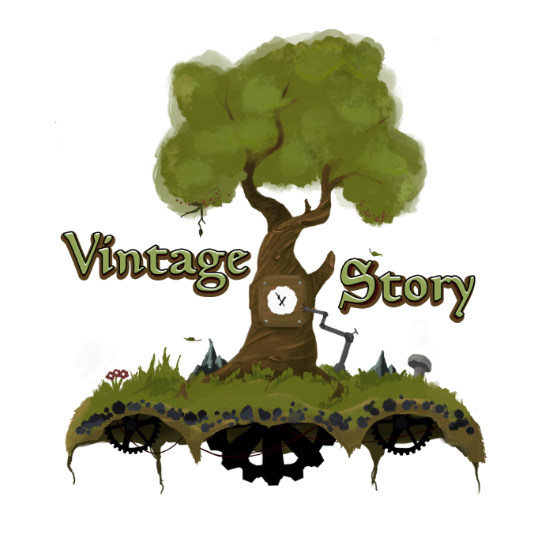

## Table of Contents
- [About Vintage Story](#about-vintage-story)
- [Dedicated Server Docker Image](#dedicated-server-docker-image)

## About Vintage Story

Vintage Story is an uncompromising wilderness survival sandbox that takes everything you know from block-based games 
and adds authentic complexity. Progress through five metallurgical eras—from knapping flint tools to building steel 
production chains—using hands-on crafting systems where you actually chip stone, hammer metal on anvils, and sculpt 
clay voxel by voxel. The world generates with focus on realistic geology, implementing 22 rock types in proper strata,
climate-driven seasons that transform gameplay, and a unique temporal horror dimension: your stability meter drains 
underground, spawning increasingly dangerous Drifters as it drops, while periodic temporal storms force you into 
fortified bunkers. Late-game mechanical power systems let you automate grinding, pulverizing, and forging with 
windmill-driven factories.

Choose from six character classes each with unique traits, explore a procedurally generated world spanning 
climate zones from tundra to desert, and tackle an optional 8-chapter story featuring dungeons, NPCs, and boss 
encounters. The game supports both hardcore survivalists (permadeath, harsh winters, cave-ins) and peaceful builders 
(creative mode, reduced combat) through extensive world customization. Multiplayer includes land claiming, while a 
robust C# modding API allows the ability to extend the experience infinitely. Built for survival veterans seeking 
genuine depth beyond the Minecraft formula.

## Dedicated Server Docker Image
Vintage Story Dedicated Server Docker Image, built on Ubuntu 24.04 is based on the official Vintage Story server 
installation instructions, and extracted from server.sh for better Docker compatibility.

Official dedicated server guide: https://wiki.vintagestory.at/Guide:Dedicated_Server

### Usage
To run the Vintage Story Dedicated Server Docker container, use the following command:
```bash
docker run -d \
  --name vintagestory-server \
  -p 42420:42420/tcp \
  -p 42420:42420/udp \
  -v /path/to/your/vs/data:/vintagestory/data \
  --restart unless-stopped \
  ghcr.io/ralnoc/vintagestory
```
Note: Replace `/path/to/your/vs/data` with the path to the directory one your server, where you want to persist your 
Vintage Story server data. This is critical to ensure that your world data, configurations, and mods are not lost when 
upgrading, which results in the container being removed.

When starting the server, remember to map the data directory to a persistent volume on your host machine to ensure 
that your server data is not lost when the container is removed. If you leverage the docker image 
`ghcr.io/ralnoc/vintagestory`, it will always install the latest version of Vintage Story server. This will 
dramatically simplify the upgrade process, and removes any issues with the in place upgrade, as you are replacing the 
image, not upgrading in place. 

### Configuration
There are four options for handling configuration of the Vintage Story server:
1. Use the default configuration, as defined within the Docker image. This is not recommended for production use.
2. Pre-create the `serverconfig.json` configuration file in your mapped data directory. This file will be used by the server 
   on first run.
3. Create an updated `server-config.yaml` and mount it into the container at `/vintagestory/server-config.yaml`. This
   will cause the server to generate a `serverconfig.json` file based on the provided YAML configuration.
4. Use environment variables to override specific configuration options. See the list of supported environment variables
   below.

#### Environment Variables
You can enable additional logging by setting one of the following environment variables:
- `ENABLE_DEBUG_LOGGING=true` - Enables debug level logging
- `ENABLE_CHAT_LOGGING=true` - Enables chat logging
- `VS_CFG_SERVER_NAME` - Set the server name
- `VS_CFG_SERVER_URL` - Set the server URL
- `VS_CFG_SERVER_DESCRIPTION` - Set the server description
- `VS_CFG_WELCOME_MESSAGE` - Set the welcome message
- `VS_CFG_ALLOW_CREATIVE_MODE` - Enable or disable Allow Creative Mode
- `VS_CFG_SERVER_IP` - Set the server IP
- `VS_CFG_SERVER_PORT` - Set the server port
- `VS_CFG_SERVER_UPNP` - Enable or disable UPNP
- `VS_CFG_SERVER_COMPRESS_PACKETS` - Enable or disable packet compression
- `VS_CFG_ADVERTISE_SERVER` - Enable or disable server advertisement
- `VS_CFG_MAX_CLIENTS` - Set the maximum number of clients
- `VS_CFG_PASS_TIME_WHEN_EMPTY` - Enable or disable pass time when empty
- `VS_CFG_SERVER_PASSWORD` - Set the server password
- `VS_CFG_MAX_CHUNK_RADIUS` - Set the maximum chunk radius
- `VS_CFG_SERVER_LANGUAGE` - Set the server language
- `VS_CFG_ONLY_WHITELISTED` - Enable or disable only whitelisted players
- `VS_CFG_ANTIABUSE` - Enable or disable anti-abuse
- `VS_CFG_ALLOW_PVP` - Enable or disable PvP
- `VS_CFG_HOSTED_MODE` - Enable or disable hosted mode
- `VS_CFG_HOSTED_MODE_ALLOW_MODS` - Enable or disable hosted mode mods

Example of running the container with environment variable overrides:
```bash
docker run -d \
  --name vintagestory-server \
  -p 42420:42420/tcp \
  -p 42420:42420/udp \
  -v /path/to/your/vs/data:/vintagestory/data \
  -e ENABLE_DEBUG_LOGGING=true \
  -e ENABLE_CHAT_LOGGING=true \
  -e VS_CFG_SERVER_NAME="My Vintage Story Server" \
  --restart unless-stopped \
  ghcr.io/ralnoc/vintagestory

```

### Viewing Logs
The Vintage Story server logs are routed to standard output and standard error. The can then be viewed using the 
command: `docker logs vintagestory-server`.

### Building the Docker Image
To build the Docker image locally, use the following command:
```bash
docker build -t vintagestory:1.21.5 --build-arg VS_VERSION=1.21.5 --build-arg DOTNET_VERSION=8.0 .
```
This command builds the Docker image and tags it as `vintagestory:1.21.5`. You can replace `1.21.5` with the desired 
version of Vintage Story by changing the `VS_VERSION` build argument. If building on a linux server, you can use an 
environment variable to set the version:
```bash
export VS_VERSION=1.21.5
export DOTNET_VERSION=8.0
docker build -t vintagestory:$VS_VERSION --build-arg VS_VERSION=$VS_VERSION --build-arg DOTNET_VERSION=$DOTNET_VERSION .
```
This will build the Docker image with the specified version of Vintage Story and .NET SDK.

#### Docker Compose
You can also use Docker Compose to manage the Vintage Story server container. Below is an example `docker-compose.yml` file:
```yaml
version: '3.8'
services:
  vintagestory-server:
    image: ghcr.io/ralnoc/vintagestory:latest
    container_name: vintagestory-server
    ports:
      - "42420:42420/tcp"
      - "42420:42420/udp"
    volumes:
      - /path/to/your/vs/data:/vintagestory/data
    environment:
      - ENABLE_DEBUG_LOGGING=true
      - ENABLE_CHAT_LOGGING=true
      - VS_CFG_SERVER_NAME=My Vintage Story Server
    restart: unless-stopped
```
To start the server using Docker Compose, run the following command in the directory where your `docker-compose.yml` file is located:
```bash
docker-compose up -d
```
This command will start the Vintage Story server container in detached mode.

#### Docker Compose Build
If you want to build the Docker image using Docker Compose, you can add a `build` section to the `docker-compose.yml` file:
```yaml
version: '3.8'
services:
    vintagestory-server:
        build:
            context: .
            args:
                VS_VERSION: 1.21.5
                DOTNET_VERSION: 8.0
        image: vintagestory:1.21.5
        container_name: vintagestory-server
        ports:
        - "42420:42420/tcp"
        - "42420:42420/udp"
        volumes:
        - /path/to/your/vs/data:/vintagestory/data
        environment:
        - ENABLE_DEBUG_LOGGING=true
        - ENABLE_CHAT_LOGGING=true
        - VS_CFG_SERVER_NAME=My Vintage Story Server
        restart: unless-stopped
```